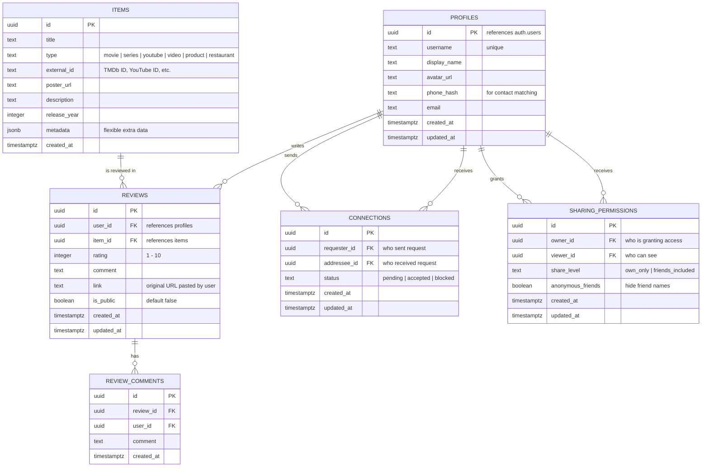

# FriendLens — Social Review & Recommendation Network (Android)

An Android-first social app where users rate & review content (movies, series, YouTube, etc.), discover what their friends and extended network recommend, and explore a visual recommendation web. iOS support will be added in a future phase.

---

## User Review Required

> [!IMPORTANT]
> **Backend: Supabase (New Account)**
> ✅ Confirmed — creating a new Supabase account with a fresh email to get 2 free projects. This gives us the all-in-one stack (DB + Auth + Storage + Realtime).

> [!IMPORTANT]
> **Android-Only Focus**: This MVP targets Android only. iOS will be a future phase. We'll use Expo Go / dev builds on Android for testing.

> [!IMPORTANT]
> **Phased Approach (5 Phases)**:
> - Phase 1: Project Setup + Infrastructure + DB Abstraction Layer
> - Phase 2: Authentication + Onboarding
> - Phase 3: Reviews System + TMDb Integration
> - Phase 4: Friends + Sharing Permissions
> - Phase 5: Network Graph + Search

> [!IMPORTANT]
> **Database Abstraction Layer**: All data access uses a Repository Pattern with TypeScript interfaces. Supabase is the initial implementation, but the abstraction allows swapping to any backend (e.g., Elasticsearch for search, custom API, different DB) without touching UI or business logic.

---

## Open Questions

> [!NOTE]
> **All questions resolved:**
> - ✅ **Backend**: New Supabase account (fresh free projects)
> - ✅ **Auth**: Email/Password + Google OAuth (Android only, no Apple Sign-In for now)
> - ✅ **TMDb**: Added as mandatory in Phase 2 — auto-fetch movie/show details (poster, title, year)
> - ✅ **YouTube**: Store raw URL only for MVP, auto-extract later
> - ✅ **Rating**: 1-10 star scale
> - ✅ **Anonymous model**: Clarified below

### Anonymous Sharing Model (Confirmed)

When Person A connects with Person B and sets sharing to "friends included + anonymous":
- Person B sees **A's reviews with A's real name** (direct friend, always visible)
- Person B sees **A's friends' reviews with random pseudonyms** (e.g., "User_7x3k") — they can see the ratings and comments but NOT who wrote them
- This way B gets the value of the extended network's recommendations without knowing the actual identities of A's friends

---

## Tech Stack

| Layer | Technology | Rationale |
|-------|-----------|-----------|
| **Framework** | Expo SDK 56 (latest) | Cross-platform, managed workflow, OTA updates |
| **Navigation** | Expo Router v4 (file-based) | Native tab navigation, deep linking, type-safe routes |
| **Backend** | Supabase (PostgreSQL + Auth + Storage) | Relational data, RLS, real-time subscriptions |
| **State Management** | Zustand | Lightweight, minimal boilerplate |
| **Styling** | React Native StyleSheet + Linear Gradient | Full control, premium look |
| **Platform** | Android only (Expo Go / dev build) | iOS in future phase |
| **Graph Visualization** | D3.js (force layout math) + react-native-svg | Interactive network graph, no WebView overhead |
| **Movie Data** | TMDb API | High-quality metadata + posters |
| **Icons** | @expo/vector-icons (Ionicons) | Native feel, consistent across platforms |
| **Animations** | React Native Reanimated 3 | Smooth 60fps micro-animations |
| **Contacts** | expo-contacts | Friend discovery from phone contacts |

---

## Database Schema (Supabase / PostgreSQL)



### Key Database Functions (Supabase RPC)

```sql
-- Get friends-of-friends recommendation chain (recursive)
CREATE OR REPLACE FUNCTION get_network_reviews(
    p_user_id uuid,
    p_depth integer DEFAULT 2,  -- how many hops deep
    p_item_type text DEFAULT NULL
)
RETURNS TABLE (
    review_id uuid,
    reviewer_name text,      -- real name for direct friends
    reviewer_pseudonym text,  -- random pseudonym for friends-of-friends (when anonymous)
    is_anonymous boolean,
    item_title text,
    item_type text,
    rating integer,           -- 1-10 scale
    comment text,
    depth integer  -- 0 = own, 1 = friend, 2 = friend-of-friend
) AS $$
-- Recursive CTE traversing the connections graph
-- Respects sharing_permissions for each hop
-- For depth > 0 with anonymous_friends=true, replaces real names with pseudonyms
$$;

-- Search across entire network for a specific item
CREATE OR REPLACE FUNCTION search_network_reviews(
    p_user_id uuid,
    p_search_query text,
    p_type_filter text DEFAULT NULL
)
RETURNS TABLE (...) AS $$
-- Full-text search across items + reviews within user's network
-- Respects anonymous sharing: shows pseudonyms for non-direct friends
$$;
```

---

## App Architecture & Screens

### File Structure (Expo Router)

```
app/
├── _layout.tsx                    # Root layout (auth check, providers)
├── (auth)/
│   ├── _layout.tsx                # Auth stack layout
│   ├── login.tsx                  # Login screen
│   ├── register.tsx               # Registration screen
│   └── onboarding.tsx             # Contact sync + profile setup
├── (tabs)/
│   ├── _layout.tsx                # Tab navigator layout
│   ├── index.tsx                  # 🏠 Home Feed
│   ├── search.tsx                 # 🔍 Search & Discover
│   ├── add-review.tsx             # ➕ Add Review (FAB-style center tab)
│   ├── network.tsx                # 🕸️ Network Graph
│   └── profile.tsx                # 👤 Profile & Settings
├── review/
│   └── [id].tsx                   # Review detail page
├── user/
│   └── [id].tsx                   # User profile + their reviews
├── friends/
│   ├── index.tsx                  # Friends list + requests
│   ├── discover.tsx               # Find friends from contacts
│   └── permissions.tsx            # Per-user sharing controls
└── item/
    └── [id].tsx                   # Item detail (all network reviews)
```

### Supporting Code Structure

```
src/
├── lib/
│   ├── supabase.ts                # Supabase client init
│   ├── tmdb.ts                    # TMDb API wrapper
│   └── youtube.ts                 # YouTube oEmbed helper
├── repositories/
│   ├── interfaces/                # ← ABSTRACTION LAYER (pure interfaces)
│   │   ├── IAuthRepository.ts     # Auth operations contract
│   │   ├── IReviewRepository.ts   # Review CRUD contract
│   │   ├── IItemRepository.ts     # Item lookup/create contract
│   │   ├── IConnectionRepository.ts # Friends/connections contract
│   │   ├── ISearchRepository.ts   # Search contract (swappable to Elasticsearch)
│   │   └── ISharingRepository.ts  # Sharing permissions contract
│   ├── supabase/                  # ← SUPABASE IMPLEMENTATION
│   │   ├── SupabaseAuthRepository.ts
│   │   ├── SupabaseReviewRepository.ts
│   │   ├── SupabaseItemRepository.ts
│   │   ├── SupabaseConnectionRepository.ts
│   │   ├── SupabaseSearchRepository.ts
│   │   └── SupabaseSharingRepository.ts
│   └── index.ts                   # Factory — exports concrete implementations
├── stores/
│   ├── authStore.ts               # Auth state (Zustand) — uses IAuthRepository
│   ├── reviewStore.ts             # Reviews state — uses IReviewRepository
│   ├── networkStore.ts            # Friends & network state — uses IConnectionRepository
│   └── searchStore.ts             # Search state — uses ISearchRepository
├── components/
│   ├── ui/                        # Reusable UI primitives
│   │   ├── GlassCard.tsx          # Glassmorphism card
│   │   ├── StarRating.tsx         # Interactive star rating
│   │   ├── GradientButton.tsx     # Gradient-styled button
│   │   ├── Avatar.tsx             # User avatar with status
│   │   ├── SearchBar.tsx          # Animated search input
│   │   └── FilterChips.tsx        # Horizontal filter chips
│   ├── reviews/
│   │   ├── ReviewCard.tsx         # Review display card
│   │   ├── ReviewForm.tsx         # Create/edit review form
│   │   └── ReviewList.tsx         # Scrollable review list
│   ├── network/
│   │   ├── NetworkGraph.tsx       # D3 force-directed graph
│   │   ├── GraphNode.tsx          # Individual graph node
│   │   ├── GraphEdge.tsx          # Connection line
│   │   └── NodeDetail.tsx         # Tap-to-reveal detail sheet
│   ├── friends/
│   │   ├── FriendCard.tsx         # Friend display card
│   │   ├── RequestCard.tsx        # Friend request card
│   │   └── ContactCard.tsx        # Contact discovery card
│   └── common/
│       ├── LoadingScreen.tsx      # Full-screen loader
│       ├── EmptyState.tsx         # Empty state illustrations
│       └── ErrorBoundary.tsx      # Error handling wrapper
├── hooks/
│   ├── useAuth.ts                 # Auth hook — wraps authStore
│   ├── useNetwork.ts              # Network traversal hook
│   ├── useReviews.ts              # Reviews CRUD hook
│   └── useContacts.ts             # Contact access hook
├── constants/
│   ├── colors.ts                  # Design system colors
│   ├── typography.ts              # Font scales
│   └── layout.ts                  # Spacing, breakpoints
└── types/
    └── index.ts                   # TypeScript interfaces (domain models)
```

---

## Data Access Layer (Repository Pattern)

All database operations are abstracted behind TypeScript interfaces. The app code (stores, hooks, screens) **never imports Supabase directly** — it only uses repository interfaces. This enables:

- **Swap Supabase → custom backend** without changing any UI code
- **Replace search with Elasticsearch** by implementing `ISearchRepository` with an ES client
- **Add caching layers** by wrapping repositories with decorators
- **Unit test** with mock repositories

### Interface Contracts

```typescript
// src/repositories/interfaces/IAuthRepository.ts
export interface IAuthRepository {
  signUp(email: string, password: string): Promise<AuthResult>;
  signIn(email: string, password: string): Promise<AuthResult>;
  signInWithGoogle(): Promise<AuthResult>;
  signOut(): Promise<void>;
  getCurrentUser(): Promise<User | null>;
  onAuthStateChange(callback: (user: User | null) => void): () => void;
  updateProfile(userId: string, data: Partial<Profile>): Promise<Profile>;
}

// src/repositories/interfaces/IReviewRepository.ts
export interface IReviewRepository {
  create(review: CreateReviewInput): Promise<Review>;
  update(id: string, data: Partial<Review>): Promise<Review>;
  delete(id: string): Promise<void>;
  getById(id: string): Promise<Review | null>;
  getByUserId(userId: string, options?: PaginationOptions): Promise<PaginatedResult<Review>>;
  getFeedReviews(userId: string, options?: FeedOptions): Promise<PaginatedResult<FeedReview>>;
  getNetworkReviews(userId: string, depth?: number, typeFilter?: string): Promise<NetworkReview[]>;
}

// src/repositories/interfaces/IItemRepository.ts
export interface IItemRepository {
  findOrCreate(item: CreateItemInput): Promise<Item>;
  getById(id: string): Promise<Item | null>;
  searchByTitle(query: string, type?: string): Promise<Item[]>;
}

// src/repositories/interfaces/IConnectionRepository.ts
export interface IConnectionRepository {
  sendRequest(requesterId: string, addresseeId: string): Promise<Connection>;
  acceptRequest(connectionId: string): Promise<Connection>;
  rejectRequest(connectionId: string): Promise<void>;
  blockUser(userId: string, blockedId: string): Promise<void>;
  getFriends(userId: string): Promise<Profile[]>;
  getPendingRequests(userId: string): Promise<Connection[]>;
  findUsersFromContacts(phoneHashes: string[]): Promise<Profile[]>;
}

// src/repositories/interfaces/ISearchRepository.ts
// ← THIS is the one most likely to be swapped (e.g., Elasticsearch)
export interface ISearchRepository {
  searchItems(query: string, filters?: SearchFilters): Promise<SearchResult[]>;
  searchNetworkReviews(userId: string, query: string, filters?: SearchFilters): Promise<NetworkSearchResult[]>;
  getSuggestions(query: string): Promise<string[]>;
}

// src/repositories/interfaces/ISharingRepository.ts
export interface ISharingRepository {
  getPermission(ownerId: string, viewerId: string): Promise<SharingPermission | null>;
  setPermission(permission: CreateSharingPermissionInput): Promise<SharingPermission>;
  getPermissionsForUser(ownerId: string): Promise<SharingPermission[]>;
}
```

### Factory / Dependency Injection

```typescript
// src/repositories/index.ts
import { SupabaseAuthRepository } from './supabase/SupabaseAuthRepository';
import { SupabaseReviewRepository } from './supabase/SupabaseReviewRepository';
import { SupabaseSearchRepository } from './supabase/SupabaseSearchRepository';
// ... etc

// Current implementation: Supabase
// To switch backends, change ONLY this file
export const repositories = {
  auth: new SupabaseAuthRepository(),
  reviews: new SupabaseReviewRepository(),
  items: new SupabaseItemRepository(),
  connections: new SupabaseConnectionRepository(),
  search: new SupabaseSearchRepository(),    // ← swap to ElasticsearchSearchRepository later
  sharing: new SupabaseSharingRepository(),
};

// Example: future swap for search only
// search: new ElasticsearchSearchRepository(esClient),
```

### How Stores Use Repositories (No Direct Supabase Imports)

```typescript
// src/stores/reviewStore.ts
import { repositories } from '../repositories';

export const useReviewStore = create((set, get) => ({
  reviews: [],
  addReview: async (input: CreateReviewInput) => {
    // Uses interface — doesn't know or care if it's Supabase, REST, or GraphQL
    const review = await repositories.reviews.create(input);
    set((state) => ({ reviews: [review, ...state.reviews] }));
  },
}));
```

---

## Screen Designs

### 1. 🏠 Home Feed (`(tabs)/index.tsx`)
- **Header**: App logo + notification bell
- **Content**: Scrollable feed of reviews from friends (sorted by recency)
- Each card shows: poster/thumbnail, title, 1-10 rating, reviewer avatar + name, comment preview
- **Depth indicators**: Subtle badge showing "Friend" vs "Friend's Friend"
- Anonymous friend-of-friend reviews show pseudonyms (e.g., "User_7x3k") instead of real names
- Pull-to-refresh, infinite scroll pagination
- **Design**: Dark theme base with glassmorphism cards, gradient accents

### 2. 🔍 Search & Discover (`(tabs)/search.tsx`)
- **Top**: Animated search bar with auto-suggestions
- **Filter chips**: `All` | `Movies` | `TV Shows` | `YouTube` | `Videos`
- **Results section**: Dual mode —
  - **Items**: Search TMDb/items database → show item card with aggregate network rating
  - **Network Reviews**: For each item, show how many in your network rated it, average rating, top comments
- Tapping an item → Item detail page with ALL network reviews for it
- **Design**: Search bar with glow effect, results in card grid/list toggle

### 3. ➕ Add Review (`(tabs)/add-review.tsx`)
- **Input**: Paste a link OR manually enter title
- **Phase 1**: Manual entry only (title, type, link URL)
- **Phase 2 (mandatory)**: Auto-detect URL → fetch metadata via TMDb for movies/shows
- **YouTube**: Store raw URL only (auto-extract in future)
- **Rating**: Beautiful interactive 1-10 star component
- **Comment**: Rich text area with character count
- **Preview**: Live preview of how the review card will look
- **Design**: Clean form with smooth transitions, haptic feedback on star select

### 4. 🕸️ Network Graph (`(tabs)/network.tsx`)
- **Interactive force-directed graph** (D3 force simulation + react-native-svg)
- **Center node**: Current user (highlighted, larger)
- **First ring**: Direct friends (connected by solid lines, shown with real names)
- **Second ring**: Friends-of-friends (connected by dashed lines, smaller)
  - If anonymous sharing: shown as pseudonym nodes ("User_7x3k") with generic avatar
  - If name sharing: shown with real names
- **Node appearance**: Avatar circles with name labels
- **Interactions**:
  - Tap a node → Bottom sheet with their reviews summary
  - Tap a friend node → Expand to show THEIR friends (deep dive, respecting privacy)
  - Pinch to zoom, drag to pan
  - Anonymous nodes shown as generic avatar with "?" icon
- **Design**: Dark canvas with neon/glowing connection lines, animated node entrance, particle effects on connections

### 5. 👤 Profile (`(tabs)/profile.tsx`)
- **Header**: Avatar, display name, username, stats (reviews count, friends count)
- **My Reviews**: Grid/list of all reviews, sortable
- **Friends**: Quick access to friends list, pending requests badge
- **Sharing Settings**: Per-friend permission controls
- **Settings**: Account, notifications, privacy, logout
- **Design**: Profile hero section with gradient background, tab switching for content sections

---

## Proposed Changes

### Phase 1: Project Setup + Infrastructure + DB Abstraction Layer

#### [NEW] Project initialization
- Create Expo project with `npx create-expo-app@latest`
- Install all dependencies (Supabase, Zustand, Reanimated, etc.)
- Configure Expo Router file structure
- Android-focused development setup

#### [NEW] [supabase.ts](file:///d:/my_projects/react_native_projects/FriendLens/src/lib/supabase.ts)
- Initialize Supabase client with AsyncStorage for session persistence
- Configure auth state change listener

#### [NEW] [colors.ts](file:///d:/my_projects/react_native_projects/FriendLens/src/constants/colors.ts)
- Premium dark theme color palette, gradient definitions, semantic color tokens

#### [NEW] [types/index.ts](file:///d:/my_projects/react_native_projects/FriendLens/src/types/index.ts)
- TypeScript interfaces for all domain models (Profile, Review, Item, Connection, etc.)
- Pagination types, API response types

#### [NEW] Repository interfaces (`src/repositories/interfaces/`)
- `IAuthRepository` — auth operations contract
- `IReviewRepository` — review CRUD + feed + network reviews contract
- `IItemRepository` — item lookup/create contract
- `IConnectionRepository` — friends/connections contract
- `ISearchRepository` — search contract (designed for future Elasticsearch swap)
- `ISharingRepository` — sharing permissions contract

#### [NEW] Supabase implementations (`src/repositories/supabase/`)
- `SupabaseAuthRepository` — implements IAuthRepository
- `SupabaseReviewRepository` — implements IReviewRepository
- `SupabaseItemRepository` — implements IItemRepository
- `SupabaseConnectionRepository` — implements IConnectionRepository
- `SupabaseSearchRepository` — implements ISearchRepository
- `SupabaseSharingRepository` — implements ISharingRepository

#### [NEW] Repository factory (`src/repositories/index.ts`)
- Exports concrete implementations; single file to change when swapping backends

#### [NEW] Design system components
- GlassCard, GradientButton, Avatar, LoadingScreen, EmptyState, ErrorBoundary

---

### Phase 2: Authentication + Onboarding

#### [NEW] Auth screens (login, register, onboarding)
- Email/password + Google OAuth (Android only)
- Profile creation (username, display name, avatar)
- Phone contact sync during onboarding

#### [NEW] Auth store + hooks
- Zustand `authStore` — uses `IAuthRepository` (never imports Supabase directly)
- Protected route middleware in root `_layout.tsx`
- `useAuth` hook for components

#### [NEW] Tab navigation skeleton
- 5-tab layout with placeholder screens for Home, Search, Add Review, Network, Profile
- Bottom tab bar with icons and labels

---

### Phase 3: Reviews System + TMDb Integration

#### [NEW] Add Review flow
- Manual entry: title, type selector (movie/series/youtube/video), link URL, description
- TMDb integration (MANDATORY): search-as-you-type for movie/show lookup, auto-fetch poster/title/year
- YouTube: store raw URL only (auto-extract in future)
- Interactive 1-10 star rating component
- Comment text area with character count
- Review CRUD operations via `IReviewRepository`

#### [NEW] Review display components
- ReviewCard with glassmorphism design
- ReviewList with infinite scroll pagination
- Home feed showing own reviews
- Item detail page (all reviews for one item)

#### [NEW] TMDb API wrapper (`src/lib/tmdb.ts`)
- Movie/show search endpoint
- Detail fetch with poster URLs
- Caching layer for repeated lookups

---

### Phase 4: Friends + Sharing Permissions

#### [NEW] Friend discovery & management
- Contact-based discovery (hashed phone matching) — Android contacts via expo-contacts
- Friend request send/accept/reject via `IConnectionRepository`
- Friends list with search
- Pending requests badge on Profile tab

#### [NEW] Sharing permissions system
- Per-user permission controls via `ISharingRepository`
- `own_only` vs `friends_included` toggle
- Anonymous friend toggle (friends-of-friends shown as pseudonyms like "User_7x3k")
- Permissions management screen

#### [NEW] Home feed upgrade
- Feed now shows friends' and friends-of-friends' reviews
- Depth badges ("Friend" / "Friend's Friend")
- Anonymous pseudonyms for friends-of-friends when privacy enabled

---

### Phase 5: Network Graph + Search

#### [NEW] Interactive network visualization
- D3 force-directed layout engine
- SVG rendering with react-native-svg
- Gesture handling (pinch zoom, pan, tap)
- Recursive node expansion on tap
- Anonymous nodes (generic avatar + pseudonym) for hidden friends
- Bottom sheet with review summary on node tap

#### [NEW] Full-network search
- Search across entire friend network via `ISearchRepository`
- Filter by content type (movie, TV show, YouTube, etc.)
- Aggregate 1-10 ratings from network
- Item detail page with all network reviews
- Auto-suggestions as user types

---

## Design System

### Color Palette (Dark Theme)
```
Background:       #0A0A0F (deep dark)
Surface:          #14141F (cards)
Surface Elevated: #1E1E2E (raised elements)
Primary:          #6C5CE7 → #A855F7 (purple gradient)
Accent:           #00D2FF → #7B68EE (cyan-purple gradient)
Success:          #00E676
Warning:          #FFD600
Error:            #FF5252
Text Primary:     #F0F0F5
Text Secondary:   #8888AA
Text Muted:       #555577
Star Active:      #FFD700 (gold)
Star Inactive:    #333355
Glass Border:     rgba(255, 255, 255, 0.08)
Glass Background: rgba(20, 20, 31, 0.7)
```

### Typography
- **Font Family**: Inter (via Google Fonts / expo-font)
- **Headings**: Inter Bold, tracking -0.5
- **Body**: Inter Regular
- **Caption**: Inter Medium, uppercase tracking

### Micro-animations
- Card press: scale(0.97) with spring physics
- Star rating (1-10): bounce effect on select
- Tab switch: cross-fade with slide
- Network graph: spring-animated node positions
- Review card: fade-in stagger on list load
- Pull to refresh: custom lottie animation

---

## Verification Plan

### Automated Tests
```bash
# Type checking
npx tsc --noEmit

# Lint
npx expo lint

# Start dev server (verify no build errors)
npx expo start
```

### Manual Verification
1. **Phase 1 — Infrastructure**: Verify repository pattern works, Supabase connection successful
2. **Phase 2 — Auth flow**: Register → Login → Logout → Login cycle (Android)
3. **Phase 3 — Add review**: TMDb search → auto-fill poster/details → rate 1-10 → save → see on home feed
4. **Phase 4 — Friend flow**: Send request → accept → verify reviews visible (with anonymous pseudonyms for FoF)
5. **Phase 5 — Network graph**: Verify nodes render, tap expands, anonymous nodes show pseudonyms
6. **Phase 5 — Search**: Search for a movie → verify network reviews appear with correct privacy
7. **All phases**: Test on Android emulator and physical device via Expo Go

### Browser Testing
- Use Expo Go on Android physical device for gesture testing (pinch zoom on graph)
- Test on Android emulator + physical device

---

## Estimated Effort

| Phase | Description | Complexity |
|-------|-------------|------------|
| Phase 1 | Setup + Infrastructure + DB Abstraction | High |
| Phase 2 | Authentication + Onboarding | Medium |
| Phase 3 | Reviews System + TMDb Integration | High |
| Phase 4 | Friends + Sharing Permissions | High |
| Phase 5 | Network Graph + Search | Very High |
| **Total** | **Complete Android MVP** | **5 phases** |

I will build all 5 phases sequentially, completing each before moving to the next. Android-only focus throughout.

---

## Future Phases (Post-MVP)
- iOS support (Apple Sign-In, App Store submission)
- YouTube auto-extract (thumbnail, title via oEmbed)
- Product reviews (Amazon, Flipkart)
- Restaurant reviews
- Push notifications
- Richer media embeds
- Advanced recommendation algorithms
